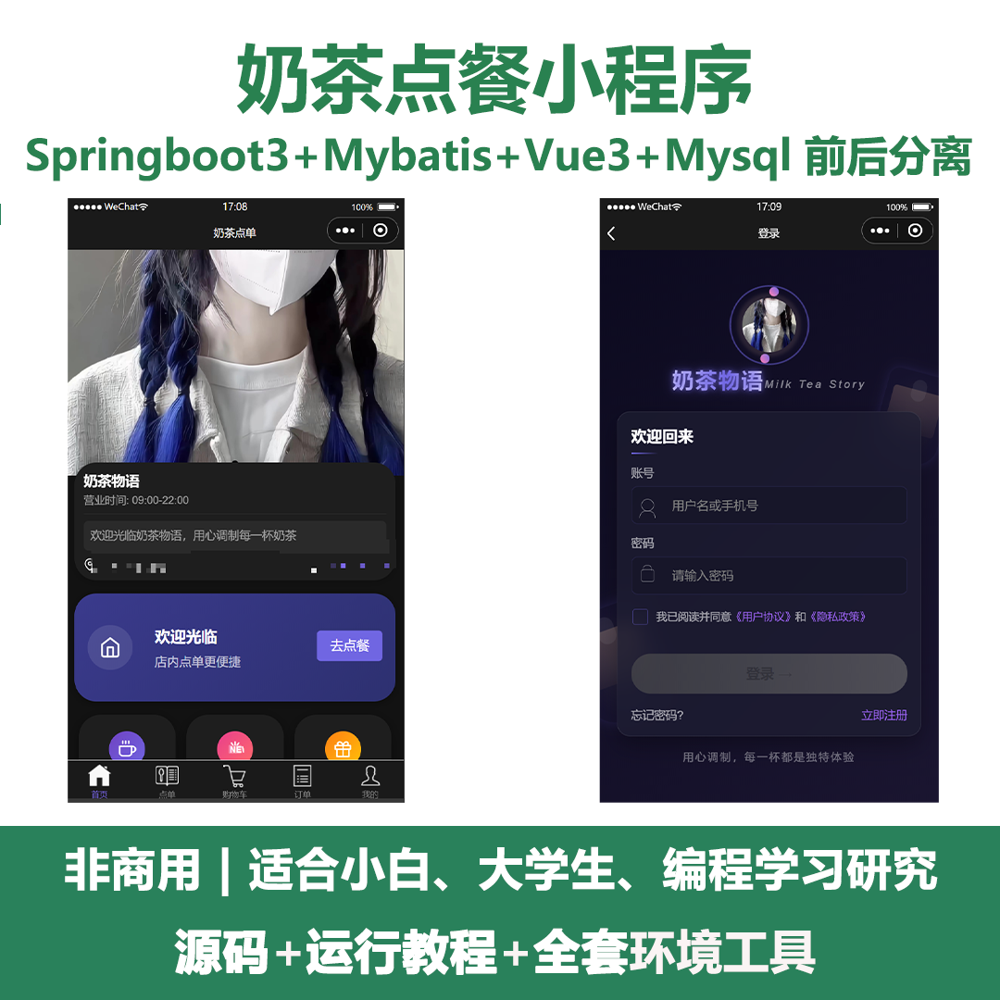
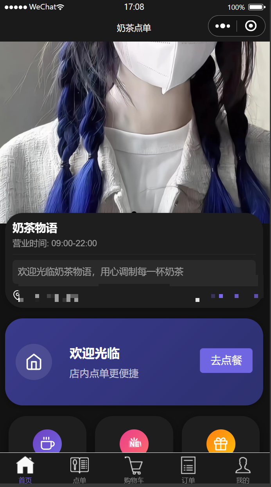
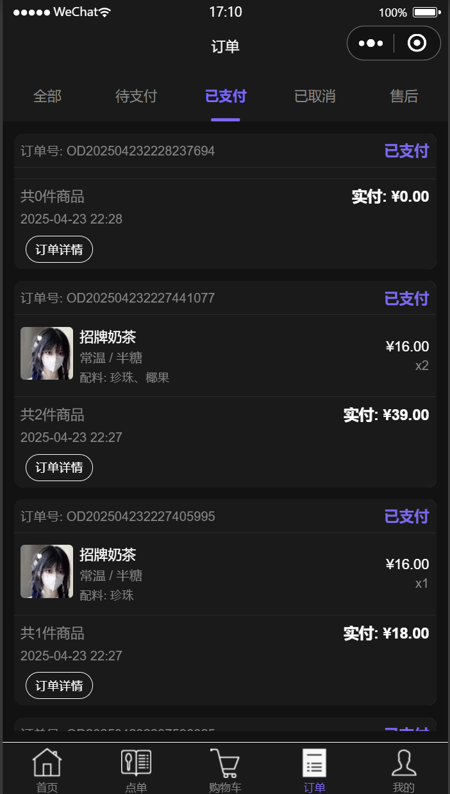
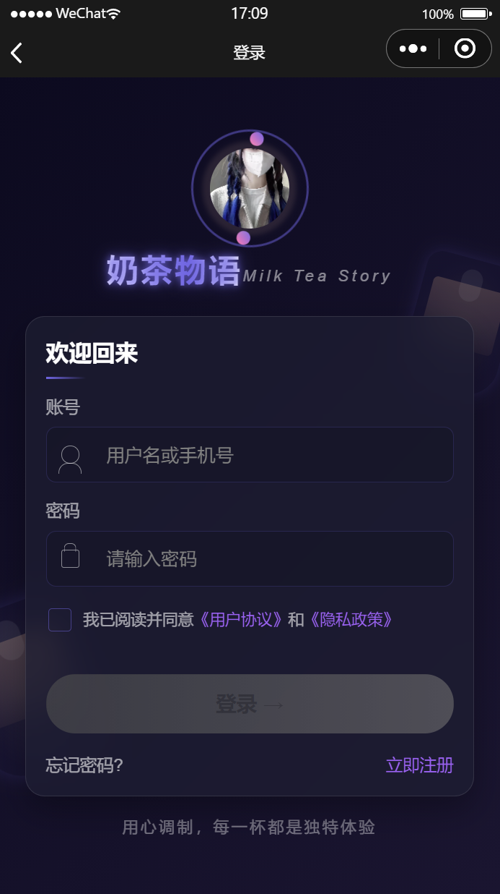
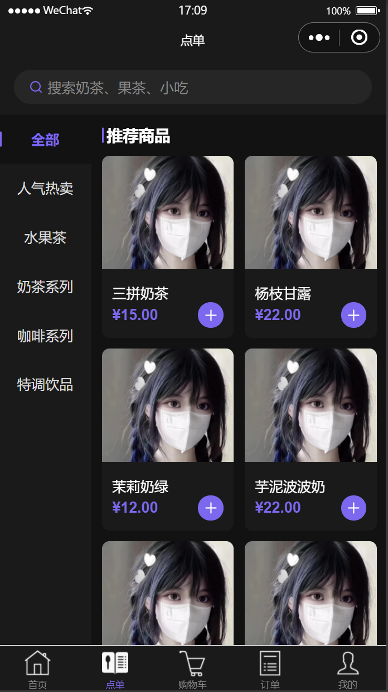
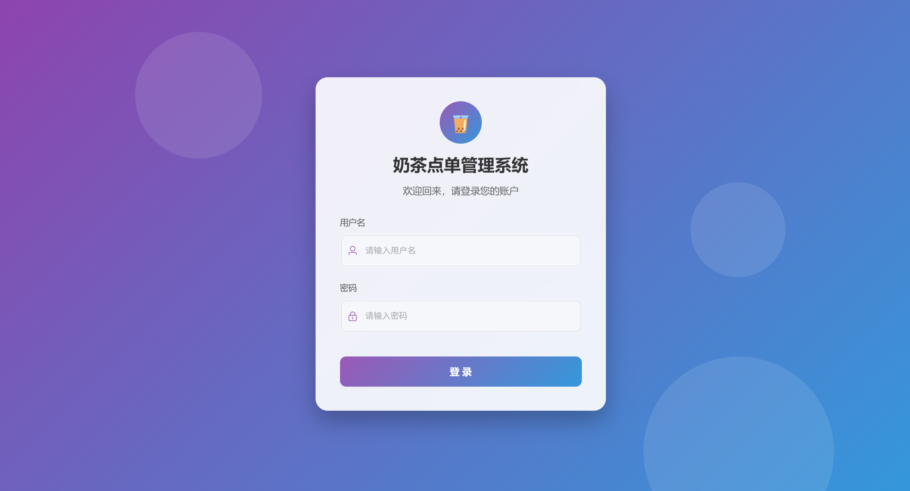
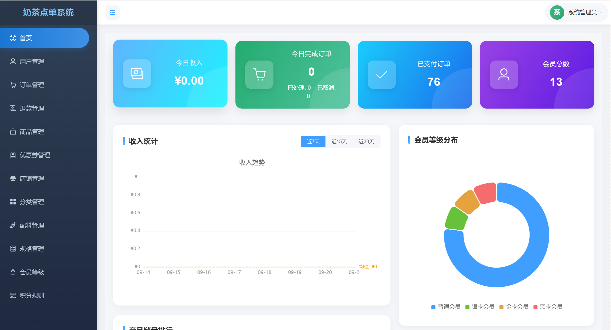
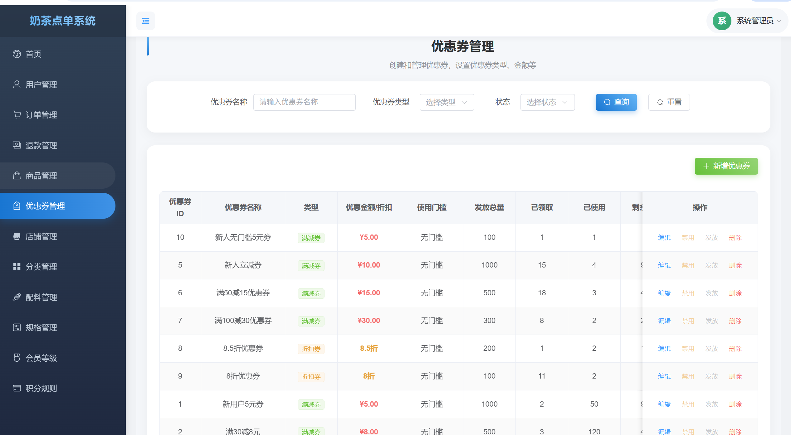
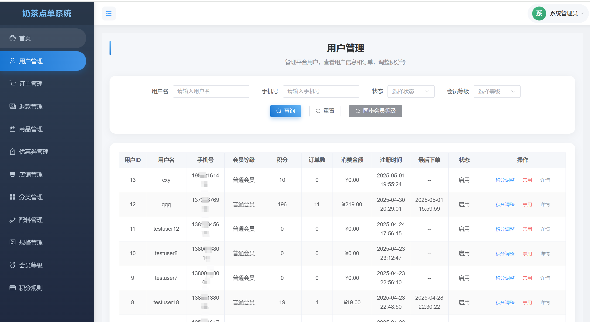

# mpweixinA101
mpweixinA101奶茶点餐微信小程序
 
## 查看主页获取源码

### 一、关键词
奶茶点餐小程序、奶茶点单管理系统

### 二、作品包含
源码+数据库+全套环境和工具资源+本地部署教程

### 三、项目技术
前端技术： Html、Css、Js、Vue3.0、Element Plus、uniapp、Echarts
后端技术：Java、SpringBoot3.0、MyBatis、JTW、Redis

### 四、运行环境（以下版本亲测，其他版本兼容性请自行测试）
开发工具：IDEA/eclipse  + VSCODE + 微信开发者工具 + HBuilder X

数据库：MySQL8.0

数据库管理工具：Navicat10以上版本

环境配置软件： JDK17 + Maven3.6.3

前端Nodejs：18

浏览器：谷歌浏览器

### 五、项目介绍
项目编号：mpweixinA101

奶茶点单系统是一个全栈开发的电商项目，专为奶茶店设计，支持线上点单、会员管理、营销活动等功能。系统包含三个主要部分：后端服务、管理员前端和客户端小程序。

功能模块
### 用户端功能
- **用户认证**：登录、注册、密码找回
- **商品浏览**：分类展示、商品详情、搜索
- **购物车**：添加商品、调整规格、配料添加
- **订单管理**：创建订单、支付、查看订单状态
- **会员中心**：积分查询、签到、会员等级
- **优惠券**：领取优惠券、使用优惠券
- **个人中心**：地址管理、账户设置

### 管理端功能
- **数据统计**：销售额、订单量、用户增长统计
- **商品管理**：商品添加、编辑、上下架
- **分类管理**：商品分类管理
- **规格管理**：定义商品规格、配料选项
- **订单管理**：订单处理、状态更新、退款管理
- **会员管理**：会员信息、消费记录
- **优惠券管理**：创建优惠券、设置规则
- **系统设置**：店铺信息设置、权限管理

### 六、运行截图

